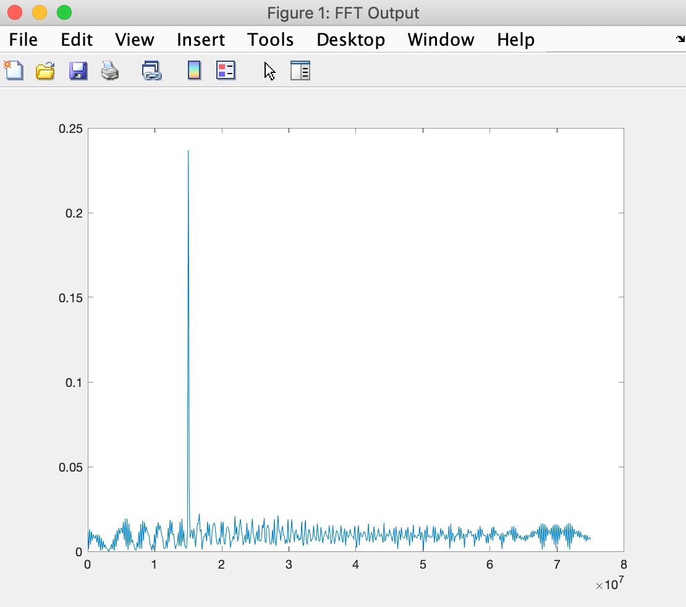
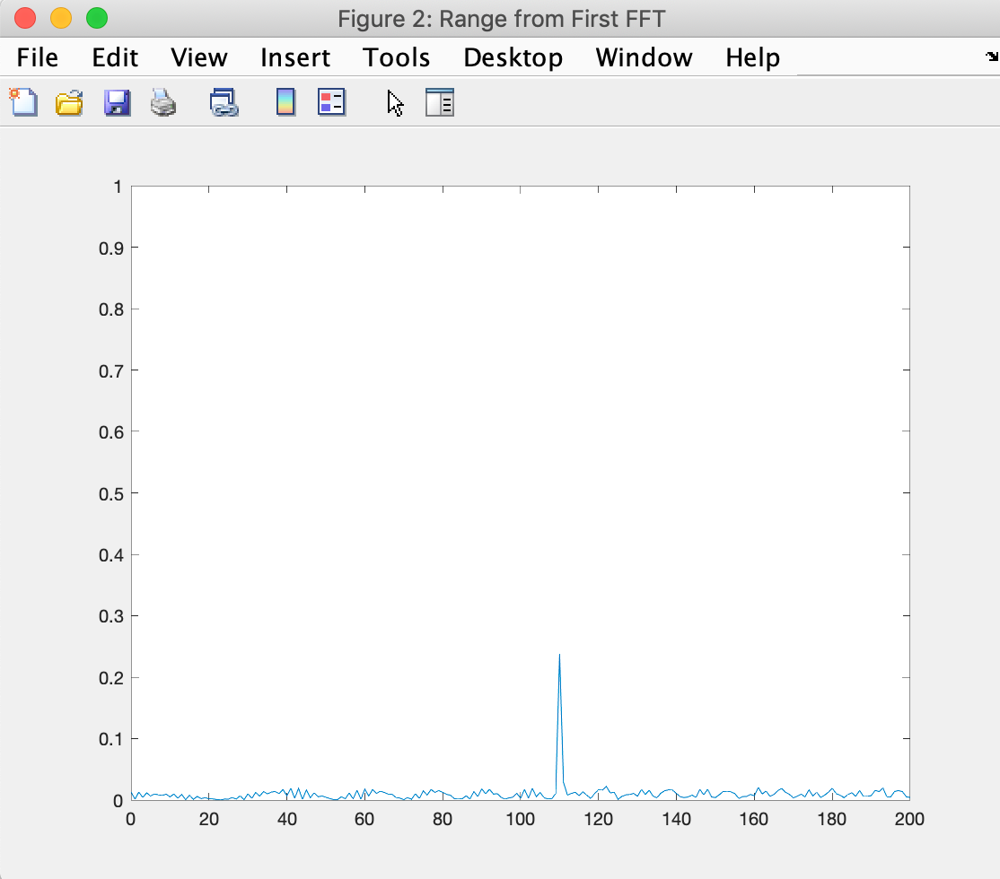
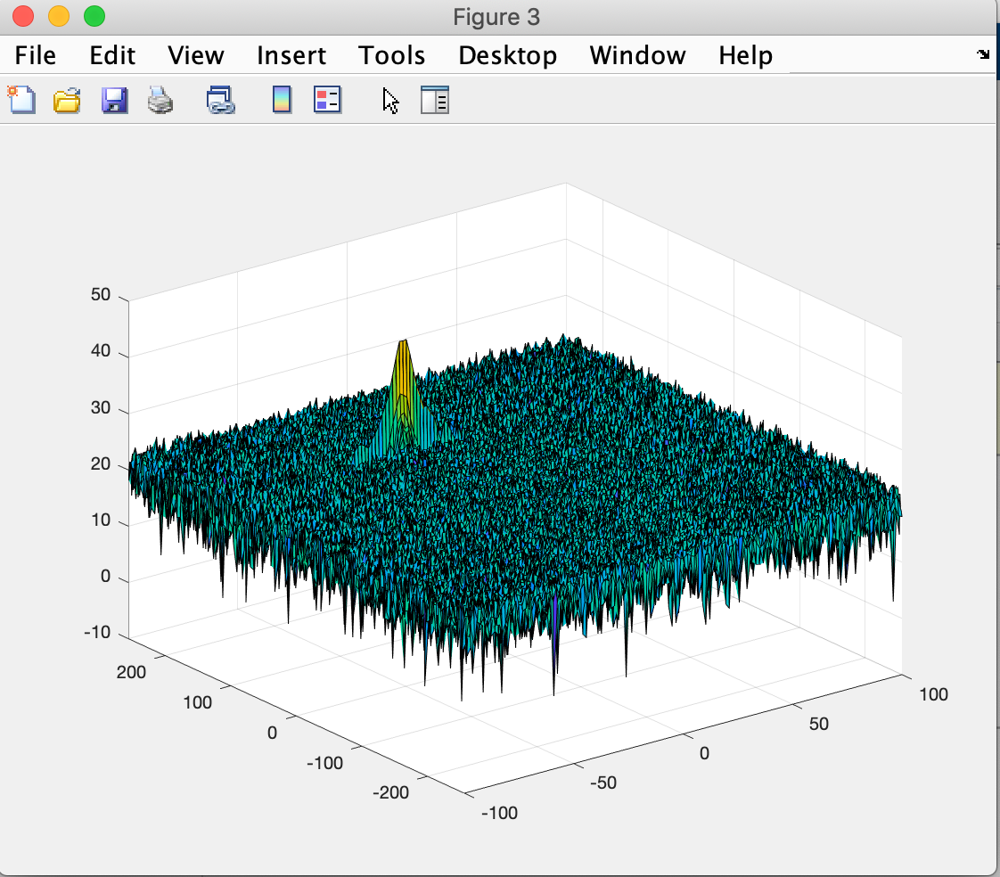
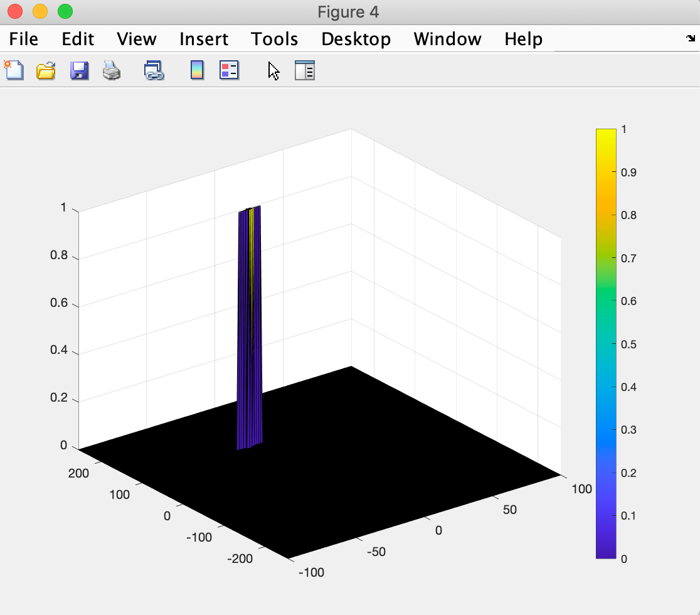

## Radar Target Generation and Detection


### Goal

In this project:


*   Configure the FMCW waveform based on the system requirements.
*   Define the range and velocity of target and simulate its displacement.
*   For the same simulation loop process the transmit and receive signal to determine the beat signal
*   Perform Range FFT on the received signal to determine the Range
*   Towards the end, perform the CFAR processing on the output of 2nd FFT to display the target.


### Determining the Range

After determining the beat signal and performing range FTT, the output is





Using the frequency from above, we calculate the range as


```
f = Bsweep*(0:(L/2))/L;
R = (c*Tchirp*f)/(2*Bsweep);
```


Output of Range estimation:





### 2D FTT

The 2D FTT is run on the mixed signal (beat signal) output to generate the Range Doppler Map.





### 2D CFAR process

The main outcome of the coherent processing procedure applied to the received echo signal is the two-dimensional range-Doppler-matrix (RDM), which is the basis for an adaptive constant false alarm rate (CFAR) target detection technique. The well-known one-dimensional cell averaging (CA) CFAR procedure suffers from masking effects in all multitarget situations and is additionally very limited in the proper choice of the reference window length. In contrast the ordered statistic (OS) CFAR is very robust in multitarget situations but requires a high computation power. Therefore two-dimensional CFAR procedure based on a combination of OS and CA CFAR is proposed.


#### Implementation Steps


*   The number of Training Cells in both the dimensions are selected

    **Tr = 14**


    **Td = 6**

*   The number of Guard Cells in both dimensions around the Cell under test (CUT) for accurate estimation are selected

    **Gr = 6**


    **Gd = 3**

*   The offset the threshold by SNR value in dB

    **Offset = 6**

*   Slide the Cell Under Test (CUT) across the complete matrix making sure the CUT has margin for Training and Guard cells from the edges.
*   For each iteration we sum the signal level across the training cells and then average is calculated.
*   Offset is added to the threshold to calculate the new threshold.
*   Next, compare the signal under CUT against this threshold.
*   If the CUT signal level is greater than the Threshold, assign a value of 1, else equate it to zero.
*   Since the cell under test are not located at the edges, due to the training cells occupying the edges, we suppress the edges to zero. Any cell value that is neither 1 nor a 0, assign it a zero.




